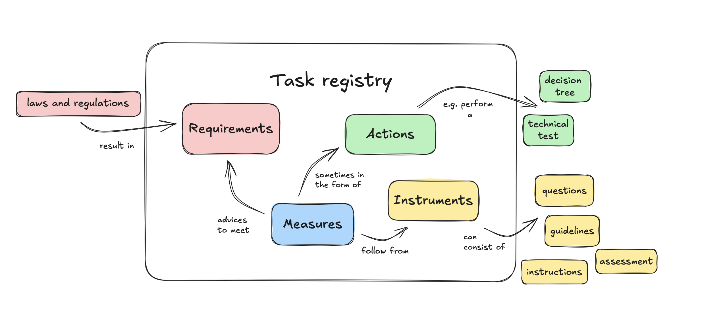

# 1. Task Registry

This registry is an overarching architecture to group all Tasks that can be performed in the context of algorithm and AI-system management, compliance and governance. The purpose of the register is to bridge policy and running code.
A task could be part of an instrument and correspond to a maatregel/measure and/or vereisten/requirement (see 2. Definitions).

The registry is deployed here: [https://task-registry.apps.digilab.network/](https://task-registry.apps.digilab.network/).

A graphical overview of the task registry and its components is shown below:

# 2. Definitions
The definitions of maatregel/measure, vereisten/requirement and instrument are as defined by the [Algoritmekader](https://minbzk.github.io/Algoritmekader/).
Since definitions are often closely tied to language, we provide them in both English and Dutch.

## English
- **Tasks:** A task is a specific action or set of actions to be performed to comply with a measure, directive or requirement relating to the responsible and effective use of algorithms and AI systems. A task can be part of a broader framework (such as the Algorithm Framework) or comprise an individual action, such as going through a decision tree to determine which risk category applies based on the AI regulation.

- **Measures:** Recommendations for meeting requirements for governments. Measures are not mandatory and with one measure you sometimes meet multiple requirements. They are advices from:
    - Algorithms Assessment Framework
    - General Audit Office
    - Research framework for algorithms
    - National Audit Office
    - National and international standards (NEN, JTC21 and ISO)
    - Algorithm framework working group

- **Requirements:** The requirements are based on the laws and regulations for performing statutory tasks, such as the
    - EU AI Act
    - General data protection regulation
    - General Administrative Law Act
    - General Equal Treatment Act
    - Copyright Act
    - Baseline Information Security Government
    - Dutch Constitution

- **Instruments:** Tools for responsible and effective use of algorithms and AI systems such as guidelines, standards, guidance documents. Most tools are not mandatory, but others are. Examples are:
    - IAMA
    - DPIA

## Nederlands
- **Tasks:** Een taak is een specifieke actie of reeks handelingen die moet worden uitgevoerd om te voldoen aan een maatregel, richtlijn of vereiste met betrekking tot het verantwoord en effectief gebruik van algoritmes en AI-systemen. Een taak kan deel uitmaken van een breder kader (zoals het Algoritmekader) of een individuele actie omvatten, zoals het doorlopen van een beslisboom om te bepalen welke risicocategorie van toepassing is op basis van de AI-verordening.

- **Maatregels:** Adviezen om te voldoen aan de vereisten voor overheden. De maatregelen zijn niet verplicht en met een maatregel voldoe je soms aan meerdere vereisten. Het zijn adviezen uit:
    - Toetsingskader Algoritmes, Algemene Rekenkamer
    - Onderzoekskader algoritmes, Auditdienst Rijk
    - Nationale en internationale standaarden (NEN, JTC21 en ISO)
    - Werkgroep Algoritmekader

- **Vereisten:** De vereisten zijn gebaseerd op de wetten en regels voor het uitvoeren van wettelijke taken, zoals de:
    - AI-verordening
    - Algemene verordening gegevensbescherming (AVG)
    - Algemene wet bestuursrecht (Awb)
    - Algemene wet gelijke behandeling (Awgb)
    - Auteurswet
    - Baseline Informatiebeveiliging Overheid (BIO)
    - Grondwet

- **Instrumenten:** Hulpmiddelen voor verantwoord en effectief gebruik van algoritmes en AI-systemen zoals richtlijnen, standaarden, leidraden. De meeste instrumenten zijn niet verplicht, maar andere wel. Zoals:
    - IAMA
    - DPIA
